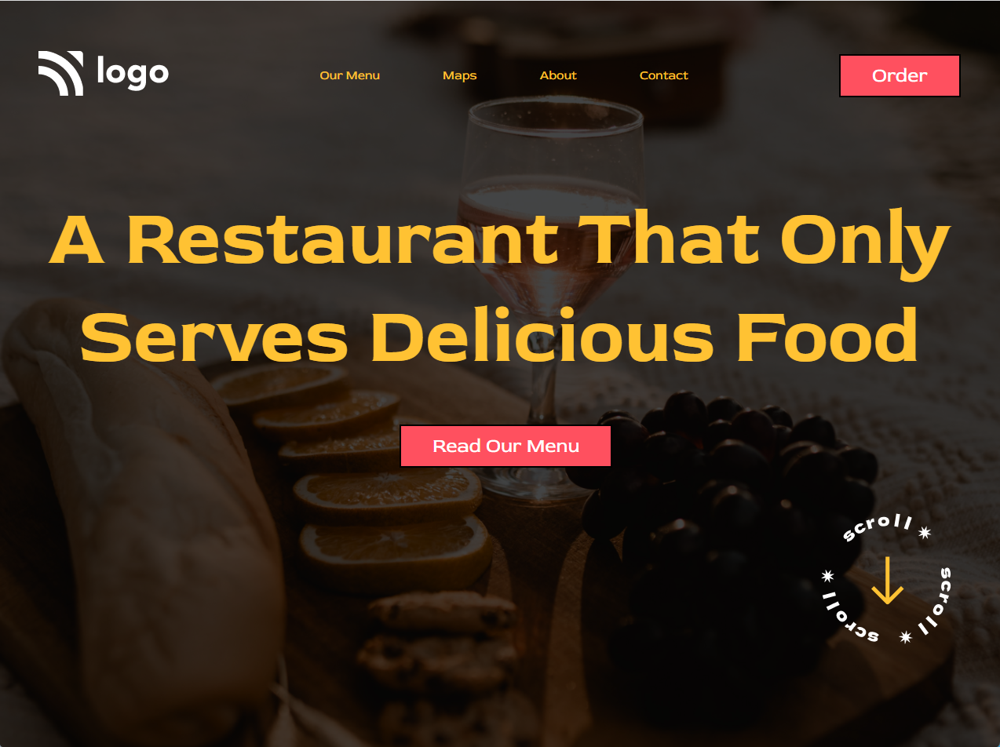

# Project-2
## Developed by Thomas Thurzo

https://project-2-thomas.netlify.app/

### Notes:

Project 2 is so far not yet responsive. 

### What I have learnt in this project:

I learnt about positions in CSS. Relativ, fixec, absolut etc.
And I learnt about background images.

### Time to finish the project:

3-4 hours